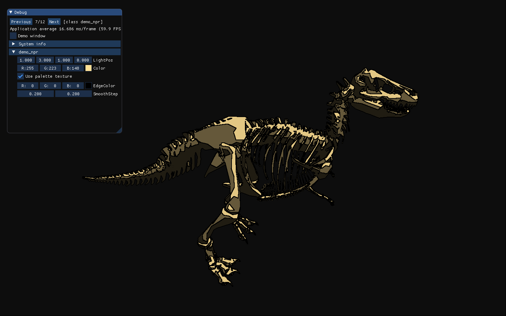

# Graphic effects - PBR - OpenGL/C++
### ISART DIGITAL : School Project - GP2 - MARIN Benjamin - LEGRAND Sasha - GINER Rémi

---

<!-- ABOUT THE PROJECT -->
# About The Project
The goal of the project is to learn different rendering technics using IBR Engine. Our group was focused on implementing Physically Based Rendering.

## Built with
Visual Studio 2019

<!-- GETTING STARTED -->

## Installation
Compile with Visual Studio 2019 in C++ 17

## How to launch
Launch with Visual Studio

---

# Features & Usage

## Controls
The controls are made for QWERTY so, switch your keyboard in QWERTY
The player controls are:
- W - Forward
- S - Backward
- A - Left
- D - Right   
- Space - Upward
- Ctrl - Downward
- Left click - Rotate camera
- Right click - Lock camera
- ESCAPE - Unlock camera

## Features

*Physically Based Rendering*

*Non Photorealistic Rendering*

*Post-processing*

*Bloom and HDR*

*Normal Mapping*

*Deferred Shading*

*Shadow Mapping*

*Skybox*

*Instancing*

*Picking*

# Details
## Versionning
We used Git Lab for the versioning.

## Authors
**MARIN Benjamin**

**LEGRAND Sasha**

**GINER Rémi**
